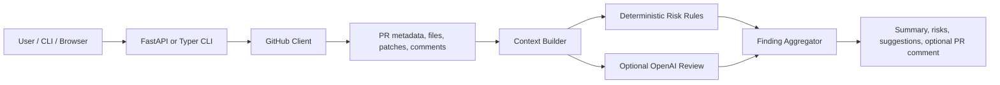

# Design Notes

## User Needs

Developers reviewing PRs usually need a fast answer to four questions:

1. What changed, and why does it matter?
2. Which files deserve human attention first?
3. Are there likely bugs, security issues, or maintainability risks?
4. What concrete comments could I leave without rewriting the PR myself?

This tool is designed around that workflow. It produces a concise summary first, then ranks risks and suggestions by severity and confidence. It avoids pretending every finding is certain; each suggestion carries evidence and confidence so reviewers can decide quickly.

## Architecture

The deterministic analyzer is always available and fast. The optional model pass improves context understanding for larger or more nuanced changes.

## Model Choice

Default model: `gpt-4.1-mini`.

Reasons:

- Low latency and cost for PR-sized review requests.
- Strong enough instruction following for structured JSON output.
- Good fit for a second-pass reviewer after deterministic rules flag concrete evidence.

For very large or high-risk repositories, a future deployment can route security-critical PRs to a stronger model and keep routine PRs on the default model.

## Context Acquisition

The tool gathers context from GitHub in this order:

1. PR metadata: title, body, author, base/head refs.
2. Changed files: status, additions, deletions, patch hunks.
3. Existing PR comments: used to avoid repeating already-discussed feedback.
4. Optional repository file contents can be added later through the `ContextProvider` boundary.

Patch text is budgeted before analysis. The context builder keeps the most review-useful signals: filenames, file status, hunk headers, changed lines, and local line numbers.

## False Positive And False Negative Control

The tool reduces noisy comments through:

- Confidence scores per finding.
- Severity and category labels instead of a flat list.
- Duplicate suppression by fingerprint.
- Ignoring generated and lock files for most style-oriented rules.
- Emitting evidence snippets so humans can reject weak findings quickly.

It reduces missed issues by combining broad deterministic rules with optional model reasoning. Deterministic rules catch common high-signal patterns, while the model can connect intent across files.

## Speed

The GitHub client uses async HTTP. The analyzer is local and linear in changed lines. Model input is compacted before any OpenAI call to avoid sending entire repositories.

## Future Extensions

- Inline review comments mapped to exact diff positions.
- Repository-wide semantic search for changed symbols.
- Custom organization policy packs.
- SARIF export for security dashboards.
- CI integration that fails only on high-confidence critical findings.
- Reviewer memory that learns accepted and dismissed suggestions over time.
