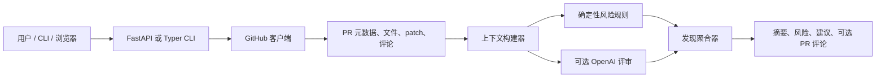

# 设计说明

## 用户需求

开发者在评审 PR 时，通常需要快速回答四个问题：

1. 变更了什么，为什么重要？
2. 哪些文件最值得优先人工关注？
3. 是否可能存在 bug、安全问题或可维护性风险？
4. 在不替作者重写 PR 的前提下，我可以留下哪些具体评论？

本工具围绕这个工作流设计。它会先生成简洁摘要，再根据严重级别和置信度对风险与建议排序。工具不会假装每个发现都是绝对确定的；每条建议都会附带证据和置信度，方便评审者快速判断。

## 架构

确定性分析器始终可用，并且响应速度快。可选的模型分析阶段用于提升对大型或更复杂变更的上下文理解能力。

## 模型选择

默认模型：`gpt-4.1-mini`。

选择原因：

- 对 PR 规模的评审请求来说，延迟和成本较低。
- 对结构化 JSON 输出具备足够强的指令遵循能力。
- 适合作为确定性规则标记具体证据之后的二次评审者。

对于非常大型或高风险仓库，未来部署时可以将安全关键 PR 路由到更强模型，同时让日常 PR 继续使用默认模型。

## 上下文获取

工具会按以下顺序从 GitHub 获取上下文：

1. PR 元数据：标题、描述、作者、base/head 引用。
2. 变更文件：状态、增加行数、删除行数、patch hunk。
3. 已有 PR 评论：用于避免重复已经讨论过的反馈。
4. 后续可以通过 `ContextProvider` 边界加入可选的仓库文件内容。

在分析前会对 patch 文本进行预算控制。上下文构建器会保留对评审最有帮助的信号：文件名、文件状态、hunk 头、变更行和本地行号。

## 误报与漏报控制

工具通过以下方式减少噪声评论：

- 为每条发现提供置信度分数。
- 使用严重级别和类别标签，而不是一份无差别列表。
- 通过 fingerprint 抑制重复发现。
- 对多数偏风格类规则忽略生成文件和 lock 文件。
- 输出证据片段，让人工评审者可以快速拒绝较弱发现。

工具通过结合广覆盖的确定性规则和可选模型推理来减少漏报。确定性规则用于捕获常见的高信号模式，模型则可以跨文件理解变更意图。

## 速度

GitHub 客户端使用异步 HTTP。分析器在本地运行，复杂度与变更行数线性相关。任何 OpenAI 调用之前都会压缩模型输入，避免发送整个仓库。

## 未来扩展

- 将内联 Review 评论映射到精确 diff 位置。
- 对变更符号进行仓库级语义搜索。
- 支持自定义组织策略包。
- 导出 SARIF，接入安全仪表盘。
- 集成 CI，仅在高置信度的严重问题上失败。
- 引入评审者记忆，学习已接受和已忽略的建议。
